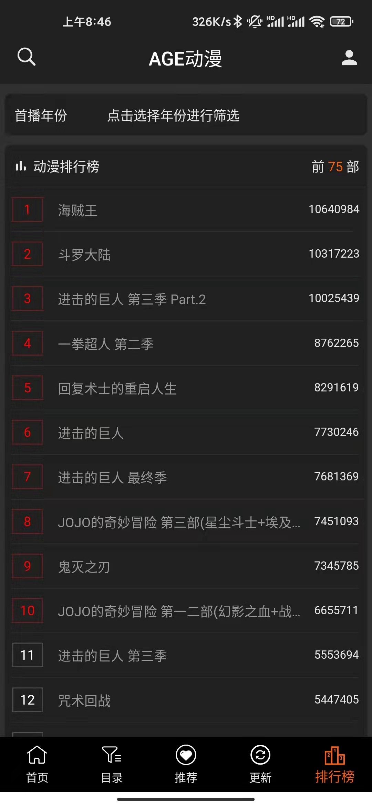

[](https://github.com/mny459/flutter_age_fans/actions)
[](https://github.com/mny459/flutter_age_fans/stargazers)
[](https://github.com/mny459/flutter_age_fans/network)
[](https://github.com/mny459/flutter_age_fans/issues)

# AGE动漫第三方客户端
这是一款基于 Flutter 编写的 [AGE动漫](https://www.agefans.live/) 第三方客户端，主要目的是为了巩固自身的 Flutter 技能

该项目致力于成为一个良好的 Flutter 的入门项目，尽可能的保持简单明了的项目结构与良好的代码规范。

如果您喜欢该项目，希望不要吝啬您的Star或Fork，感谢

如果有需要，也希望各位可以支持 [AGE动漫](https://www.agefans.live/) 和 官方APP [下载地址](https://www.agefans.app/)

# 声明
**项目中的 API 均来自AGE动漫，纯属学习交流使用，不得用于商业用途！**


# 体验
- Android: [直接下载体验](./intro/app-release.apk)
- iOS、Mac、Windows、Web：下载本项目运行

## 运行本项目

>运行本项目前请先确保本地有Flutter环境，我的环境为 Flutter 2.8.1 Dart 2.15

clone本项目

```
cd flutter_age_fans
flutter packages get
flutter run
```

# 主要功能与截图

- 基于最新版本的 Flutter

- AGE 本身具有的功能：参见截图
- 基于 DiskCache 本地缓存

| 首页 | 目录页 | 推荐页 |
| :--: | :--: | :--: |
|      |      |      |

|   更新页   |   排行榜页   |  登录注册页 |
| :--: | :--: | :--: |
|      |      |      |

|   详情页   |   播放页   |
| :--: | :--: | 
|      |      | 

# TODO

> 每周都会更新完善一点点

## 代码规范
- 尽可能多的注释

## 功能
- 视频播放自定义控制
- 添加启动广告页
- 收藏完善
- 修改密码
- Cookie
- 整理各个平台打包方式（mac、web、iOS）
- 主题集中管理

## 性能优化与监测

# 更新日志
- v1.0.0 初始化项目

# Thinks

<details><summary>感谢所有依赖的作者</summary>

```yaml
# 状态管理
# https://pub.dev/packages/provider
provider: ^6.0.2
# https://pub.dev/packages/stacked
stacked: ^2.2.7+1
# https://pub.dev/packages/get_it
get_it: ^7.2.0

# UI组件
# https://pub.dev/packages/cupertino_icons
cupertino_icons: ^1.0.4
# Toast https://pub.dev/packages/oktoast
oktoast: ^3.1.5
# 下拉刷新上拉加载 https://pub.dev/packages/pull_to_refresh
pull_to_refresh: ^2.0.0
# ----------- Candies 全家桶 分割线 -----------
# 图片加载 https://pub.dev/packages/extended_image
extended_image: ^6.0.1
# 文字加载，目前主要是用了 joinChar 方法 https://pub.dev/packages/extended_text
extended_text: ^8.0.2
# 视频播放器 https://pub.dev/packages/better_player
better_player: ^0.0.81
# 文字展开收起 https://pub.dev/packages/expandable_text
expandable_text: ^2.2.0
# 加载动画 https://pub.dev/packages/flare_flutter
flare_flutter: ^3.0.2
# Banner https://pub.dev/packages/flutter_swiper_null_safety
flutter_swiper_null_safety: ^1.0.2
# https://pub.dev/packages/webview_flutter 官方WebView插件
webview_flutter: ^3.0.0
# 监听键盘可见性：https://pub.dev/packages/flutter_keyboard_visibility
flutter_keyboard_visibility: ^5.1.0
# 底部弹窗，用在选择排行榜的年份上
flutter_pickers: ^2.1.8

# Functions
# 日志工具 https://pub.dev/packages/logging
logging: ^1.0.2
# https://pub.dev/packages/logger
logger: ^1.1.0
# 全平台KV缓存 https://pub.dev/packages/shared_preferences
shared_preferences: ^2.0.11
# 网络请求
# https://pub.dev/packages/dio
dio: ^4.0.4
# https://pub.dev/packages/dio_cookie_manager
dio_cookie_manager: ^2.0.0
# https://pub.dev/packages/cookie_jar
cookie_jar: ^3.0.1
# 浏览器打开跳转 https://pub.dev/packages/url_launcher
url_launcher: ^6.0.17
# Json解析 https://pub.dev/packages/json_annotation
json_annotation: ^4.4.0
# 文件路径获取 https://pub.dev/packages/path_provider
path_provider: ^2.0.8
# Bugly(还没用上) https://pub.dev/packages/flutter_bugly
flutter_bugly: ^0.4.3
# ============= https://plus.fluttercommunity.dev/ ==============
# 分享 https://pub.dev/packages/share_plus
share_plus: ^3.0.4
# 网络连接判断 https://pub.dev/packages/connectivity_plus
connectivity_plus: ^2.1.0
# https://pub.dev/packages/package_info_plus
package_info_plus: ^1.3.0
# 常用加解密（md5等）https://pub.dev/packages/crypto
crypto: ^3.0.1
# 剪切板功能 https://pub.dev/packages/clipboard
clipboard: ^0.1.3
# 屏幕方向控制 https://pub.dev/packages/orientation
orientation: ^1.3.0
# Disk缓存 https://pub.dev/packages/flutter_disk_lru_cache/
flutter_disk_lru_cache: ^1.0.0
```
<details>


